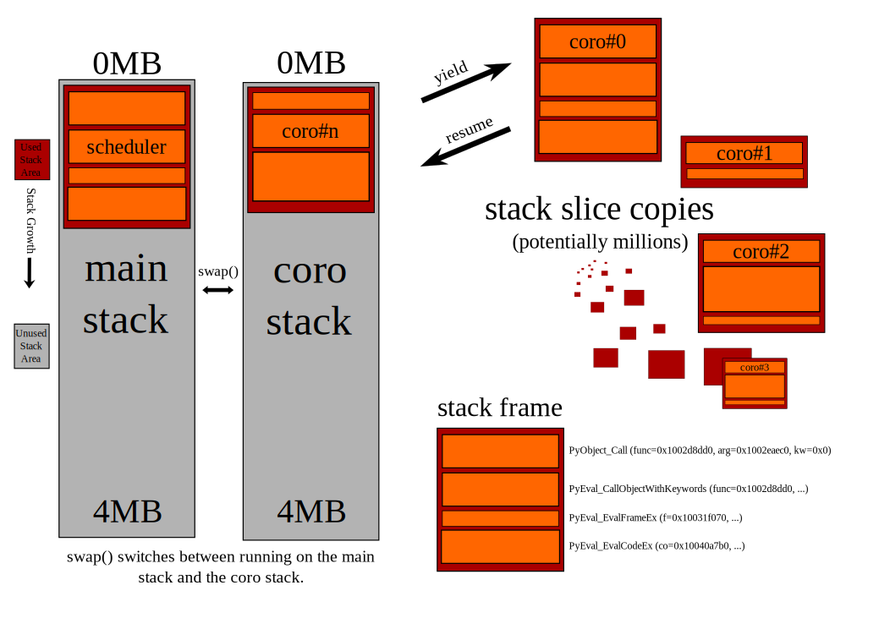

=============================
Getting Started with Shrapnel
=============================

:Date: $Date: 2012/03/30 $
:Author: Sam Rushing

.. contents::
   :depth: 2
   :backlinks: top
.. section-numbering::

Shrapnel/Coro is a highly scalable cooperative threading facility for CPython.

Intro
=====

Shrapnel is a library for high-performance concurrency.  It uses
coroutines to implement user threads on top of either kqueue (FreeBSD,
OS X) or /dev/epoll (linux), and is written mostly in Pyrex/Cython,
supporting both 32-bit and 64-bit platforms.  It is the culmination of
about 8 years of work at IronPort Systems, a provider of high-speed
mail appliances.  It was open-sourced by Cisco Systems in late 2011.

Features
--------

 * Lightweight threads, event-driven scheduler.
 * Underneath: non-blocking operations on descriptors, like sockets and pipes.
 * On top, synchronous API for straight-line, simple code.
 * Highly scalable - tens or hundreds of thousands of connections/threads.
 * Thread synchronization primitives, like mutexes, semaphores, etc...
 * Wait on kqueue events like file/directory changes, signals, processes, etc... [kqueue only]
 * DNS stub resolver (full-fledged resolver may be forthcoming)
 * HTTP server and client
 * RPC system
 * Support for TLS via tlslite (openssl interface may be forthcoming)
 * other protocols/codecs: ldap, asn1, ftp, mysql, postgres, AMQP_.
 * `MIT License`_.
 
.. _MIT License: http://www.opensource.org/licenses/mit-license.html
.. _AMQP: https://github.com/samrushing/amqp-shrapnel

The Name
--------

`Shrapnel` is the name of the implementation.  The python package that
it implements is ``coro``.  It's actually the third implementation of
the coro package written at IronPort - previous versions were written
in C using a painful type of continuation-passing style, and relied on
variants of Stackless Python.

Installing
----------

Requirements:

 * Cython (>=0.12.1)
 * distribute (>=0.6.16)

Install with::

  $ pip install coro

*or* alternatively download shrapnel from
https://github.com/ironport/shrapnel and do the usual ``setup.py`` procedure::

  $ git clone git://github.com/ironport/shrapnel.git
  $ cd shrapnel
  $ python setup.py build
  $ [sudo] python setup.py install

Basics
======

Event Loop
----------

Everything runs in the event loop.  So the last thing your ``__main__`` script will do is always::

  coro.event_loop()

Calling this function starts the scheduler, which enters a loop continually running threads that are ready to run, feeding new waitable events to the operating system, and waiting for events to be triggered.  When an event is triggered, the thread waiting on that event is awakened.

Interaction
-----------

Because everything runs in the event loop, you can't interact with the normal python prompt.  But you can interact via the 'backdoor'.  The backdoor interface is crucial to development with shrapnel.  It allows you to open one or more telnet sessions into the system and interact with a python prompt there.  So a common pattern in __main__ is this:

.. sourcecode:: python

    if __name__ == '__main__':
        import coro
        import coro.backdoor
        coro.spawn (coro.backdoor.serve, unix_path='/tmp/xx.bd')
        coro.event_loop()

Once this is running, open another terminal window and::

    $ telnet /tmp/xx.bd

[It's important to use the full path, you can't cd into /tmp and ``"$telnet xx.bd"``.]

Go ahead and run ``shrapnel/docs/tutorial/t0.py`` now, we'll use it in the following demonstration::

  $ cd shrapnel/docs/tutorial/
  $ python t0.py
  1: Sat Mar 31 16:28:44 2012 Backdoor started on unix socket /tmp/xx.bd

In another window::

  $ telnet /tmp/xx.bd 
  Trying /tmp/xx.bd...
  Connected to (null).
  Escape character is '^]'.
  Python 2.7.2 (default, Mar 10 2012, 12:30:07) 
  [GCC 4.2.1 Compatible Clang 3.1 (trunk 149115)]
  Copyright (c) 2001-2011 Python Software Foundation.
  All Rights Reserved. [etc]
  >>> 

Output
------

Note the behavior of I/O to sys.stdout/stderr when using the back door::

    >>> print "Howdy"
    Howdy

and::

    >>> sys.stdout.write ("Hello\n")
    Hello
    >>> 

i.e, they print to the terminal, not the main console.

To send debugging output to the *console*, use ``coro.write_stderr()`` and ``coro.print_stderr()``.

Skullduggery
------------

From the back door you can poke around in the internals of the system while it's running::

    >>> coro.event_map
    {<kevent_key filter=-1 ident=4>: <kevent_target status=1 index=0 target=<coro #1 name='<function serve at 0x1007e1de8>' dead=0 started=1 scheduled=0 at     0x1005c1500> flags=0>, ...}
    >>> 
    >>> 
    >>> coro.where_all()
    {1: ('<function serve at 0x1007e1de8>', <coro #1 name='<function serve at 0x1007e1de8>' dead=0 started=1 scheduled=0 at 0x1005c1500>, '[coro/backdoor.py     serve|224]'), ...}
    >>> 
    >>> player_db['annoying_guy23'].demote()
    <player annoying_guy23 id=394203 level=peon>
    >>>
    

Sleeping
--------

The sleep_relative() function allow you to put a thread to sleep for a time::

    >>> coro.sleep_relative (5)
    [5 second pause]
    >>>

Starting a New Thread
---------------------

Start a new thread with ``coro.spawn()``::

    >>> def thing():
    ...   for x in range (10):
    ...     coro.write_stderr ('%d\n' % (x,))
    ...     coro.sleep_relative (1)
    ... 
    >>> coro.spawn (thing)
    <coro #5 name='<function thing at 0x10152af50>' dead=0 started=0 scheduled=1 at 0x1005f97b0>
    >>> 

In the main window you should see a new digit printed every second.

``coro.spawn()`` takes a callable object, args, and keyword args:

.. sourcecode:: python

    coro.spawn (fun0, arg0, arg1, kwd0=val0, kwd1=val1)

Starting A *Lot* of New Threads
-------------------------------

Start up 1000 threads::

    >>> import random
    >>> def thing():
    ...   t = random.randrange (0, 15)
    ...   coro.sleep_relative (t)
    ...   coro.write_stderr ('*')
    ... 
    >>> for x in range (1000):
    ...   coro.spawn (thing)
    ... 
    >>> 

Over the next 15 seconds you should see groups of ``'*'`` characters sent to the main window.

Servers and Clients
===================

Echo Server
-----------

Creating a server is easy (see `docs/tutorial/t1.py`_):

.. sourcecode:: python

    import coro
    import coro.backdoor
    
    def session (conn, addr):
        while 1:
            block = conn.recv (1000)
            if not block:
                break
            else:
                conn.send (block)
    
    def serve (port=9000):
        s = coro.tcp_sock()
        s.bind (('', port))
        s.listen (50)
        while 1:
            conn, addr = s.accept()
            coro.spawn (session, conn, addr)
    
    if __name__ == '__main__':
        coro.spawn (coro.backdoor.serve, unix_path='/tmp/xx.bd')
        coro.spawn (serve)
        coro.event_loop()

.. _docs/tutorial/t1.py: tutorial/t1.py

You can telnet into that server::

    $ telnet localhost 9000
    Trying 127.0.0.1...
    Connected to localhost.
    Escape character is '^]'.
    asdf
    asdf
    asdf
    asdf
    asdf

[Hit ``Ctrl-], c, <return>`` to close the connection]

Timeouts
--------

One of the nicer features of shrapnel is ``with_timeout()``.  Use
``with_timeout()`` around any function call:

.. sourcecode:: python

    result = thing.db.query ("SELECT * FROM CANDYBIN;")

with a 30-second timeout becomes:

.. sourcecode:: python

    result = coro.with_timeout (30, thing.db.query, "SELECT * FROM CANDYBIN;")

If the function hasn't returned within 30 seconds, it will raise
``coro.TimeoutError``:

.. sourcecode:: python

    try:
       r = coro.with_timeout (30, function, arg0, arg1, ...)
    except coro.TimeoutError:
       coro.write_stderr ("Hey, that took too long!\n")

Multiple layers of timeouts work as expected.

.. note::

    Try editing the echo server from above, adding a timeout to the
    ``conn.recv (1000)`` call.  Make it so that it exits the loop and
    closes the connection if nothing is typed within 10 seconds.

Exiting The Event Loop
----------------------

You can tell the system to exit::

    >>> coro.set_exit()
    >>> Connection closed by foreign host.

.. note::

    Try editing the echo server from above, so that it'll exit the
    event loop when it receives the string 'quit\\r\\n'.

Echo Client
-----------

It's difficult to really beat on that server with your own fingers (and telnet).
How about a client that'll exercise it a little (see `docs/tutorial/t2.py`_):

.. sourcecode:: python

    import coro
    
    def client (ip='127.0.0.1', port=9000):
        global alive
        alive += 1
        try:
            s = coro.tcp_sock()
            s.connect ((ip, port))
            for i in range (10):
                s.send ('howdy there\r\n')
                assert (s.recv_exact (13) == 'howdy there\r\n')
            coro.write_stderr ('.')
            s.close()
        finally:
            alive -= 1
            if alive == 0:
                coro.write_stderr ('\ndone.\n')
                coro.set_exit()
    
    if __name__ == '__main__':
        alive = 0
        for i in range (100):
            coro.spawn (client)
        coro.event_loop()
    
.. _docs/tutorial/t2.py: tutorial/t2.py

Hit Ctrl-C to exit.

You should just see a hundred dots in the main window.  You might get connection reset errors if the listen() parameter in the server wasn't high enough.  If so, you could put some calls to sleep_relative() in there to stagger the creation of the clients.

Proxy Server
------------

This is a handy little server that lets you 'spy' on protocols.  It's
very handy when implementing protocols. See `docs/tutorial/proxy.py`_.

.. _docs/tutorial/proxy.py: tutorial/proxy.py

.. sourcecode:: python

    import coro
    W = coro.write_stderr
    
    class session:
        counter = 0
        def __init__ (self, conn, addr, saddr):
            self.conn = conn
            self.addr = addr
            self.saddr = saddr
            self.id = session.counter
            session.counter += 1
            self.proxy = coro.tcp_sock()
            self.proxy.connect (saddr)
            coro.spawn (self.feed, self.conn, self.proxy, '<==')
            coro.spawn (self.feed, self.proxy, self.conn, '==>')
    
        def feed (self, c0, c1, dir):
            try:
                while 1:
                    block = c0.recv (1000)
                    W ('%s %d %r\n' % (dir, self.id, block))
                    if not block:
                        break
                    else:
                        c1.send (block)
            finally:
                c0.close()
    
    def serve (saddr):
        ip, port = saddr
        s = coro.tcp_sock()
        s.bind (('0.0.0.0', port + 9000))
        s.listen (5)
        while 1:
            conn, caddr = s.accept()
            coro.spawn (session, conn, caddr, saddr)
                    
    if __name__ == '__main__':
        import sys
        if len (sys.argv) < 3:
            print 'Usage: %s <server-host> <server-port>' % sys.argv[0]
        else:
            coro.spawn (serve, (sys.argv[1], int (sys.argv[2])))
            coro.event_loop()

Let's say you want to spy on an HTTP connection::

    $ python proxy.py 72.52.84.226 80

The proxy works by adding 9000 to the port number you're connecting to.

Try this link: http://localhost:9080/tutorial_hello.html

Profiler
========

Shrapnel comes with an efficient and comprehensive profiler that
accounts for the resources used by each thread. On most platforms it
uses the RDTSC instruction to gather accurate timings with low
overhead.  It profiles both Python and Cython code:

.. sourcecode:: python

    import coro.profiler
    #coro.event_loop()
    coro.profiler.go (coro.event_loop)

By default it collects data from the ``rusage()`` facility and RDTSC,
see the documentation for details.

When the function you are profiling has exited, it will dump a binary
file containing the results (default: ``/tmp/coro_profile.bin``),
which you can post-process using the ``coro.print_profile`` module::

    $ python coro/print_profile.py /tmp/coro_profile.bin  > /tmp/p0.html

Pull that up in your browser, you'll find aggregate and non-aggregate tables, along with a call graph.

Non-Aggregate Timings

+------+--------------------+---------------+-------------------+---------------------+-------------------+------------------+---------------+---------+---------+--------+--------+-------------------------------------+
|calls |        ticks       |ticks/call     |   utime           |      utime/call     |  stime            | stime/call       | minflt        |  majflt | oublock | msgsnd | msgrcv |         Function                    |
+======+====================+===============+===================+=====================+===================+==================+===============+=========+=========+========+========+=====================================+
|0     | 29552069532        | 29552069532   |0.022320           |    0.02232          | 0.031529          |        0.031529  |      0        |     0   |    0    |   0    |   0    |     <wait>                          |
+------+--------------------+---------------+-------------------+---------------------+-------------------+------------------+---------------+---------+---------+--------+--------+-------------------------------------+
|4540  |299809652 (15.86%)  |       66037   |0.118307 (16.70%)  |     0.000026        | 0.013881 (10.17%) |      0.000003    |    2 (4.88%)  |     0   |    0    |   0    |   0    |   python/worms.py:move:141          |
+------+--------------------+---------------+-------------------+---------------------+-------------------+------------------+---------------+---------+---------+--------+--------+-------------------------------------+
|0     | 227071913 (12.01%) |   227071913   |0.093381 (13.18%)  |      0.093381       |  0.010697 (7.84%) |        0.010697  |     3 (7.32%) |     0   |    0    |   0    |   0    |    <main>                           |
+------+--------------------+---------------+-------------------+---------------------+-------------------+------------------+---------------+---------+---------+--------+--------+-------------------------------------+
|4783  |192461416 (10.18%)  |    40238      |0.072527 (10.24%)  |     0.000015        | 0.012591 (9.22%)  |      0.000003    |    1 (2.44%)  |     0   |    0    |   0    |   0    |   python2.7/random.py:randrange:173 |
+------+--------------------+---------------+-------------------+---------------------+-------------------+------------------+---------------+---------+---------+--------+--------+-------------------------------------+
|2420  | 171570517 (9.08%)  |     70896     |0.069622 (9.83%)   |      0.000029       |  0.006048 (4.43%) |        0.000002  |     1 (2.44%) |     0   |    0    |   0    |   0    |    python/worms.py:draw:185         |
+------+--------------------+---------------+-------------------+---------------------+-------------------+------------------+---------------+---------+---------+--------+--------+-------------------------------------+

From the call graph section::
  
  __builtin__:dict.has_key -- ticks=15234 utime=6e-06 stime=1e-06
           3/3          (100.0%) coro/__init__.py:spawn:337
                3           __builtin__:dict.has_key
  __builtin__:file.write -- ticks=263623 utime=4.1e-05 stime=7.5e-05
           7/7          (100.0%) python/worms.py:status:230
                7           __builtin__:file.write
  __builtin__:len -- ticks=28508261 utime=0.010467 stime=0.002547
          14/4884       (00.3%) python/worms.py:status:230
         330/4884       (06.8%) python2.7/random.py:choice:272
        4540/4884       (93.0%) python/worms.py:move:141
             4884           __builtin__:len
  [...]

Example of the full `profiler output`_.  Note: each graph may be [re]sorted by clicking on a column header.

.. _profiler output: sample_profile.html

The Killer Demo
===============

See `docs/tutorial/worms.py`_ for a fun demo.  Run the script from
one terminal, and telnet into it from another terminal with a nice
large window (your terminal needs to support ANSI escape codes).  

Each worm is its own thread, and each socket client has a separate
view into the shared 'arena'.  This demo can easily handle hundreds of
separate worms (though things tend to get crowded)::

  +=========================================================================+
  |                                                              **********d|
  |               9                                                         |
  |               9                                                         |
  |               9                                                         |
  |               9                                                         |
  |               9                                                         |
  |               9                                                         |
  |               9                                                         |
  |               9                                                         |
  |               9                                                         |
  |               9                                                         |
  |               9                                                         |
  |                                                                         |
  |                                                                         |
  |                                 b                         a             |
  |                                 b                         a             |
  |                                 b                         a             |
  |                                 b                         a      1      |
  |          eeeeee                 b                         a      1      |
  |               e                 b                         a      1      |
  |               e                 b                         a1111111      |
  |               e                 b                         a1            |
  |               e                 b                         a             |
  |               e                 b                         a             |
  |                                 b                         a             |
  |                                                                f        |
  |                                                                f        |
  |                                                                f        |
  |                                                                f        |
  |                                                                f        |
  |                                                                ffffff   |
  +=========================================================================+
   keys: [q]uit [r]edraw [n]ew [c]ull [l]engthen [h]offa

.. _docs/tutorial/worms.py: tutorial/worms.py

Here's the code controlling each worm's movement:

.. sourcecode:: python

    def go (self):
        try:
            while not self.exit:
                coro.sleep_relative (self.speed / 10000.0)
                if random.randrange (0,20) == 10:
                    if not self.turn():
                        return
                else:
                    nx, ny = self.update()
                    while self.arena[(nx,ny)] != ' ':
                        if not self.turn():
                            return
                        nx, ny = self.update()
                    self.move ((nx, ny))                        
        finally:
            self.arena.worms.remove (self)

To come: a separate tutorial on hardening servers against attack.  I
think this would be a great example to work with.

Details
=======

Exceptions
----------

What happens when there's an unhandled exception in a thread?::

    >>> def thing():
    ...   return 1/0
    ... 
    >>> coro.spawn (thing)
    <coro #205 name='<function thing at 0x1007e6758>' dead=0 started=0 scheduled=1 at 0x1005cf040>
    >>> 

You should see something like this in the main window::

    205: Sat Mar 31 17:29:06 2012 thread 205 (<function thing at 0x1007e6758>): error 
    '(\'<coro.backdoor.backdoor instance at 0x1007decf8> thing|2\', 
    "<type \'exceptions.ZeroDivisionError\'>", \'integer division or modulo by zero\', 
    \'[_coro.pyx coro._coro._wrap1 (coro/_coro.c:8821)|800] [<coro.backdoor.backdoor instance at 0x1007decf8> thing|2]\')'

The default exception handler for a thread prints a timestamp, some info about the thread that crashed, and a compact, one-line traceback.

You can replace the default handler with ``coro.set_exception_notifier()``.

Latency Warnings
----------------

It's important that no thread monopolizes the CPU for too long.  This
can happen if you inadvertently call a blocking system function (e.g.,
filesystem I/O).  To assist you in finding bugs that do this, the
scheduler will print out a warning like this::

  Wed Apr  4 00:29:01 2012 High Latency: (5.449s) for <coro #4 name='mp4 encoder' at 0x1003ceaa0>

Any thread that holds the CPU for more than 0.2s will trigger the
warning.  You can change the trigger value with ``coro.set_latency_warning()``.

SimultaneousError
-----------------

If two threads try to perform the same I/O operation (technically,
wait on the same kevent), this will trigger a ``SimultaneousError``::

  >>> coro.x.recv (100)
  Traceback (most recent call last):
    File "/usr/local/lib/python2.7/site-packages/coro/backdoor.py", line 144, in parse
      result = eval (co, env)
    File "<coro.backdoor.backdoor instance at 0x100624ef0>", line 1, in <module>
    File "socket.pyx", line 580, in coro._coro.sock.recv (coro/_coro.c:20208)
    File "socket.pyx", line 1113, in coro._coro.sock._wait_for_read (coro/_coro.c:23549)
    File "poller.pyx", line 326, in coro._coro.queue_poller._wait_for_read (coro/_coro.c:15292)
    File "poller.pyx", line 318, in coro._coro.queue_poller._wait_for_with_eof (coro/_coro.c:15204)
    File "poller.pyx", line 342, in coro._coro.queue_poller._wait_for (coro/_coro.c:15516)
    File "poller.pyx", line 304, in coro._coro.queue_poller.set_wait_for (coro/_coro.c:15056)
  SimultaneousError: <SimultaneousError co=<coro #6 name='backdoor session' dead=0 started=1 scheduled=0 at 0x1003ceaa0> other=<coro #5 name='backdoor session' dead=0 started=1 scheduled=0 at 0x1003d0080> event=<kevent_key filter=-1 ident=0>>
  >>> 

You can easily avoid this problem by isolating particular events to
their own thread.  For example, you can have one thread that *reads*
from a socket, while another *writes* to it.  You can combine
identical events from multiple threads by using one of the
synchronization primitives.  A common idiom uses a ``coro.fifo``:

.. sourcecode:: python

    def writer (self):
        while not self.exit:
            data = self.fifo.pop()
            if data is None:
                break
            else:
                self.conn.send (data)

In this example we use a sentinel (``None``) to force the fifo to wake
up and exit the loop.  This is similar to a generator's use of ``StopIteration``.

Things To Avoid
---------------

Blocking calls.  Slow file I/O.  Not closing descriptors.  *Threads*. etc.

How it Works
------------

Shrapnel works by using two (or more) C stacks.  The first stack (the
default one from libc) runs the scheduler, which is responsible for
switching out coro threads, managing the timed-events queue, and
calling kevent (or hitting /dev/epoll).  The second stack is where
coro threads run.  When it's time for a thread to run, its stack
contents are copied from the heap onto the second stack, and a small
amount of assembly code (similar to the ``ucontext`` facility)
resumes it.  When a thread yields, the portion of the stack used by
that thread is evacuated into the heap.

This design allows Shrapnel to work with a completely stock CPython.
It has been used continuously with Python 2.3 to 2.7, and can usually
be linked as a shared library against the platform's OEM install of
Python.

Credits
=======

[Get a comprehensive list of everyone that's contributed to shrapnel,
maybe with home page links?]

..
   Local Variables:
   compile-command: "rst2html.py  --embed-stylesheet --stylesheet-path=style.css  tutorial.rst tutorial.html"
   End:
